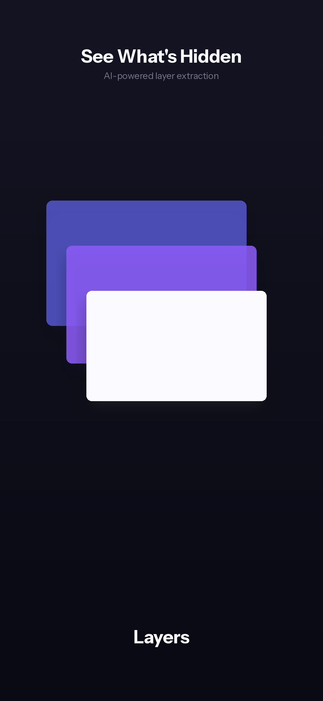
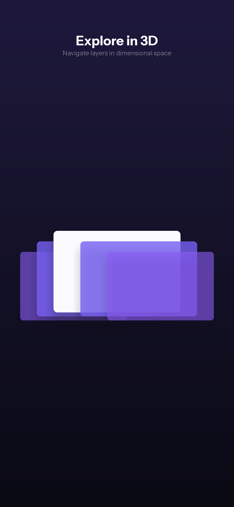
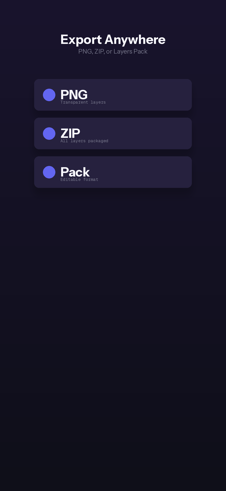
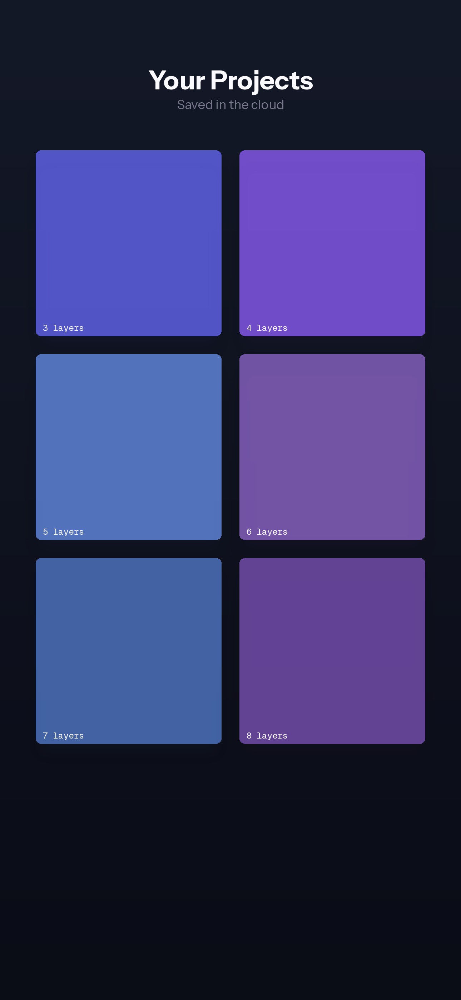
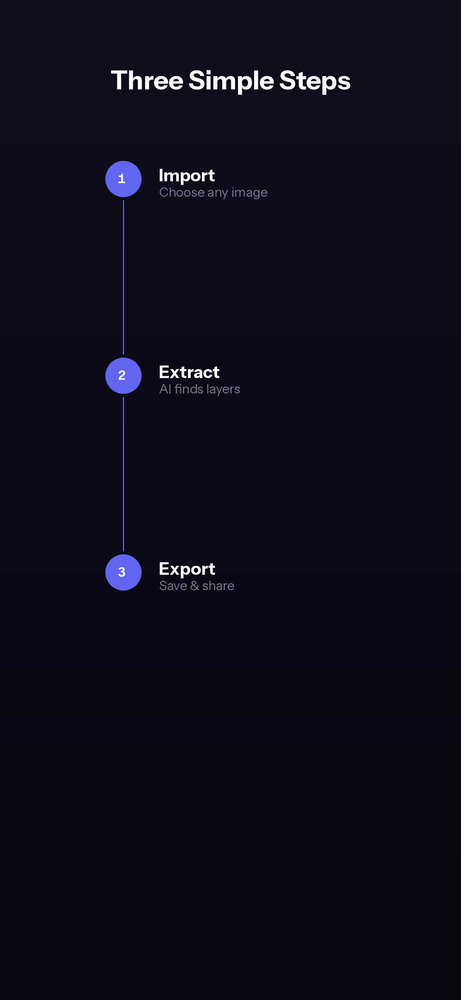

# Layers

AI-powered image layer extraction for designers, artists, and content creators who need to quickly separate subjects from backgrounds.

## Features

- **One-Tap Extraction** — Select any image, get clean layers in seconds using AI (BiRefNet)
- **3D Layer Viewer** — Visualize extracted layers as floating cards in 3D space with gesture controls
- **Multi-Format Export** — Save as PNG with transparency or PSD with preserved layers
- **Project Organization** — All extractions saved locally with cloud sync support
- **Cross-Platform** — iOS, Android, and macOS from a single codebase

## Demo
[Watch the demo](https://drive.google.com/file/d/1fSpLroVMGuGBjbU9urY40whSiseW4CrP/view?usp=sharing)

## Screenshots

<p align="center">
  
  
  
  
  
</p>

## Tech Stack

| Layer | Technology |
|-------|------------|
| Framework | Flutter 3.x |
| State | Riverpod 2.x |
| Backend | Supabase (Auth, Storage, Database) |
| AI | fal.ai BiRefNet for segmentation |
| Payments | RevenueCat (Subscriptions + Consumables) |
| Architecture | Feature-first, Provider pattern |

### Performance Highlights

- **Lazy loading** — Images loaded on-demand with caching
- **Isolate processing** — Heavy image ops run off main thread
- **Optimistic UI** — Instant feedback, background sync
- **Platform channels** — Native PSD export on iOS/macOS

## Getting Started

### Prerequisites

- Flutter 3.19+
- Xcode 15+ (iOS/macOS)
- Android Studio (Android)

### Setup

```bash
# Clone
git clone https://github.com/anthropics/layers.git
cd layers

# Install dependencies
flutter pub get

# Run
flutter run
```

### Environment

Create `.env` in project root:

```
SUPABASE_URL=your_supabase_url
SUPABASE_ANON_KEY=your_anon_key
FAL_API_KEY=your_fal_key
REVENUECAT_IOS_KEY=your_rc_ios_key
REVENUECAT_ANDROID_KEY=your_rc_android_key
```

## Project Structure

```
lib/
├── main.dart
├── providers/          # Riverpod providers
├── models/             # Data models
├── screens/            # Full-page views
├── widgets/            # Reusable components
├── services/           # API clients (Supabase, fal.ai, RevenueCat)
└── utils/              # Helpers, extensions
```

## License

Proprietary. All rights reserved.

---

Built by [Connectio](https://connectio.com.au)
